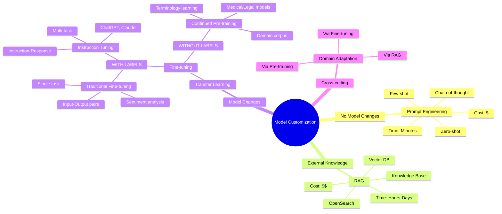

```mermaid
mindmap
  root((Model Customization))
    No Model Changes
      Prompt Engineering
        Zero-shot
        Few-shot
        Chain-of-thought
        Cost: $
        Time: Minutes
    External Knowledge
      RAG
        Knowledge Base
        Vector DB
        OpenSearch
        Cost: $$
        Time: Hours-Days
    Model Changes
      Transfer Learning
        Fine-tuning
          WITH LABELS
            Traditional Fine-tuning
              Single task
              Input-Output pairs
              Sentiment analysis
            Instruction Tuning
              Multi-task
              Instruction-Response
              ChatGPT, Claude
          WITHOUT LABELS
            Continued Pre-training
              Domain corpus
              Terminology learning
              Medical/Legal models
    Cross-cutting
      Domain Adaptation
        Via Pre-training
        Via Fine-tuning
        Via RAG
```